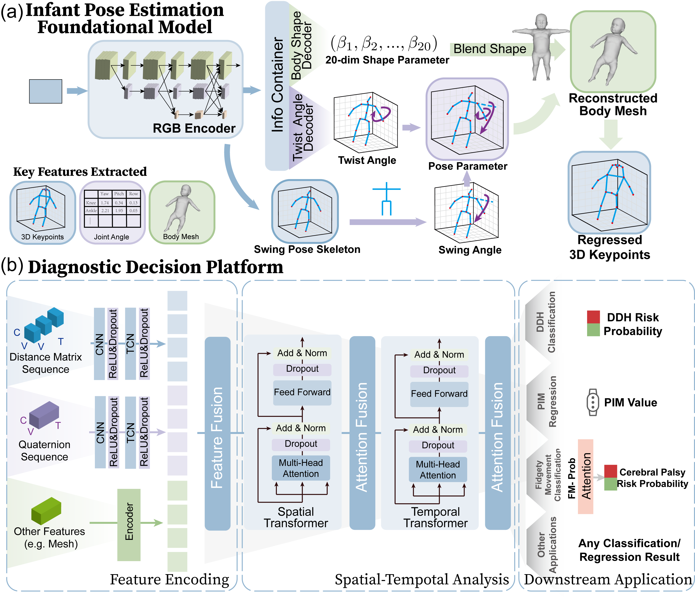

# LOVEKIDS
PyTorch implementation of "[Infant motor assessment and multi-domain clinical prediction via 3D pose estimation from monocular video"


## 🛠️ Environment

The project is developed under the following environment:
- Linux
- Python 3.8.18
- PyTorch 1.9.1
- CUDA 11.7

For installation of the project dependencies, please run:

- `pip install requirements.txt`

## 📂 Dataset
### MINI-RGBD
#### Preprocessing
Please download the dataset here: https://www.iosb.fraunhofer.de/en/competences/image-exploitation/object-recognition/sensor-networks/motion-analysis.html#mini-rgbd.

### SyRIP
#### Preprocessing
Please refer to (https://github.com/ostadabbas/Infant-Pose-Estimation) for dataset download and setup.


## 🧪 Demo
```
python demo_image.py
```

We are currently **organizing and cleaning** the code before making it fully available to the public.  

### 📅 weight:  
- comming soon...  

Stay tuned for updates, and feel free to ⭐ the repository for notifications!  


## 📄 Acknowledgement
Some code refers to the following repositories:

- [HRNet](https://github.com/HRNet/HigherHRNet-Human-Pose-Estimation)
- [HybrIK](https://github.com/jeffffffli/HybrIK)
- [MAM](https://github.com/qiang-Blazer/MAM)


Thank the authors for releasing their codes.
